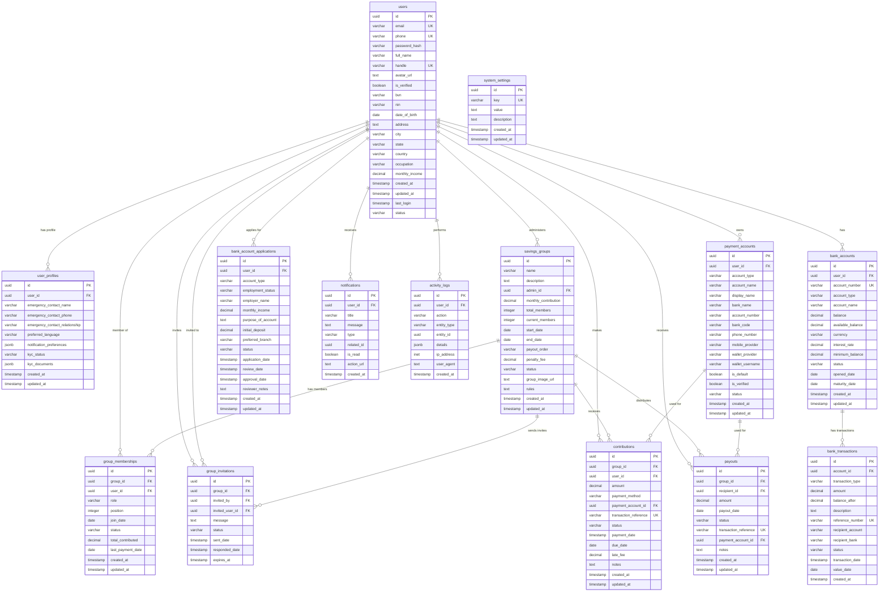

# EsusuHub Database Schema Diagram

## Entity Relationship Diagram

## Table Relationships Summary

### Core User Flow
1. **User Registration** → `users` table with basic info
2. **Profile Completion** → `user_profiles` with extended details
3. **KYC Verification** → Updates verification status

### Savings Groups Flow
1. **Group Creation** → `savings_groups` with admin user
2. **Member Invitation** → `group_invitations` sent to users
3. **Group Membership** → `group_memberships` when invitation accepted
4. **Monthly Contributions** → `contributions` tracking payments
5. **Payout Distribution** → `payouts` when member's turn arrives

### Banking Flow
1. **Account Application** → `bank_account_applications`
2. **Account Approval** → Creates `bank_accounts`
3. **Banking Transactions** → `bank_transactions` for all activities
4. **Payment Integration** → Links to `payment_accounts`

### System Features
- **Notifications** → All user alerts and messages
- **Activity Logs** → Audit trail of all user actions
- **System Settings** → Configurable application parameters

## Key Design Principles

### Security
- UUID primary keys for all tables
- Row Level Security (RLS) ready for Supabase
- Proper foreign key constraints
- Unique constraints on sensitive fields

### Performance
- Indexed fields for common queries
- Optimized for mobile app usage patterns
- Efficient relationship structures

### Scalability
- JSONB fields for flexible data storage
- Extensible user profiles and settings
- Support for multiple payment methods

### Nigerian Banking Integration
- BVN (Bank Verification Number) support
- NIN (National Identification Number) support
- Naira (NGN) currency default
- Local banking and mobile money providers

This diagram represents a production-ready database schema that can handle both savings group management and comprehensive banking services for Nigerian users.